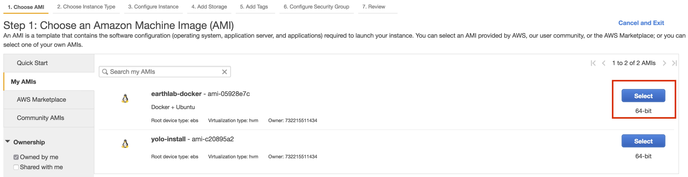
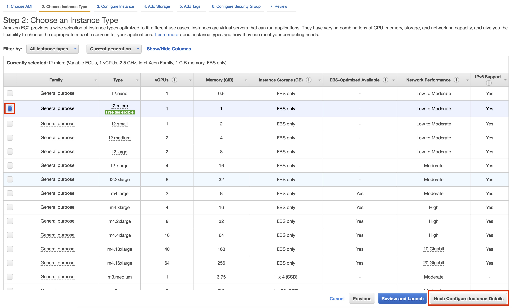
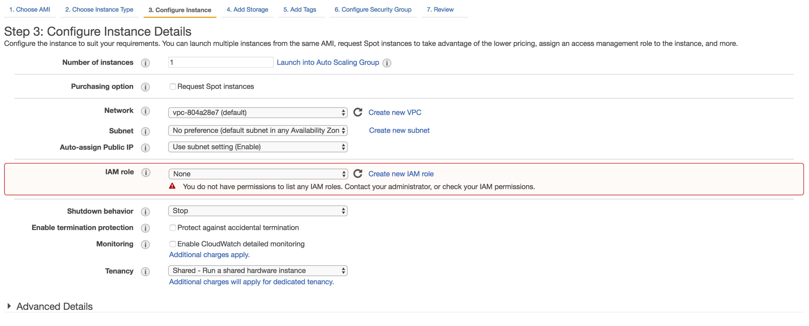
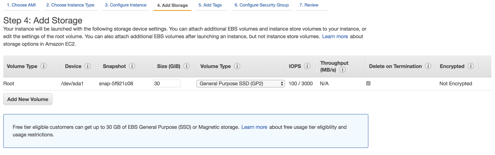
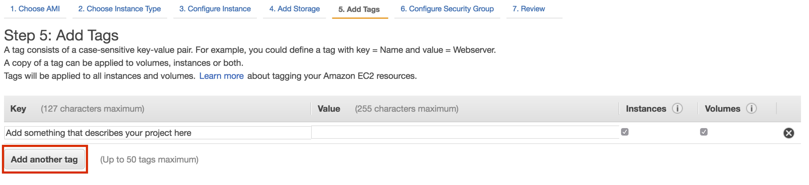
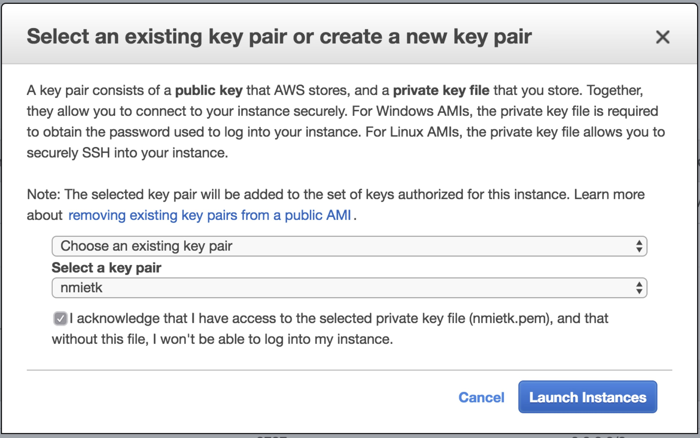
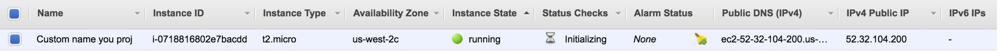
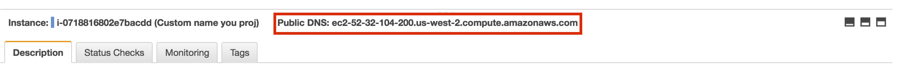

```{r setup, include=FALSE}
knitr::opts_chunk$set(echo = TRUE)
```

This is an R Markdown document that details one workflow to start an EC2 instance and load RStudio on that instance via Docker. 
This workflow is truly Earth Lab specific, but can be adapted for any lab group.


### Log in to Amazon Web Services

Well I guess, first thing is first. 
Log onto your AWS account using the sign-in link provided with your credentials, e.g., [the Earth Lab account sign-in page](https://732215511434.signin.aws.amazon.com/console) and click on the EC2 icon under **Compute**. 


### Step 1: Choosing an Amazon Machine Image

The first key step is to choose the correct Amazon Machine Image (AMI), which specifies the operating system and software initially installed on your EC2 instance. 
Within the quick start tab there are many AMIs that sit on various operating systems. 
Depending upon what you will be running any of those may be the appropriate choice. 
For this tutorial we will be using a publicly available Docker image produce by the Earth Lab which sits on an Ubuntu OS, called `earthlab-docker`. 
For anyone who has the Earth Lab credentials, this Docker image will be automatically be visible under the "My AMIs" tab. 
Select this to move on (highlighted in red).




### Step 2: Choosing an instance type

Next, choose your EC2 instance type, which refers to the hardware specifications of your instance (e.g., the number of processor cores and the amount of RAM).
After you have decided how much processing power you need, verify that it is [reasonably priced](https://aws.amazon.com/ec2/pricing/on-demand/). 
There is quite a bit of [literature](https://aws.amazon.com/blogs/aws/choosing-the-right-ec2-instance-type-for-your-application/) out there to help explain all of the different types of instances, and how you should choose given the task you want to preform.  

The two main variable you are going to be interested in are nodes and memory. 
For parallel computation, the number of nodes will be critical. 
If you have large data-sets that need to be loaded in memory you may want to opt for more RAM.




### Step 3: Configuring the instance

Leave all as default for now.
  



### Step 4: Configuring the storage

Leave all as default for now. 
Thirty GB should be fine for whatever you are doing, but depending upon your tasks and data-sets involved you may want to increase the storage.  
Here is [more information](http://docs.aws.amazon.com/AWSEC2/latest/WindowsGuide/add-instance-store-volumes.html) on how to chose the type and amount of storage, if you want to increase the capacity. 
  



### Step 5: Add project tags

Tags are important to identify your instance, especially when there are a lot of other groups using the same AWS account or you have multiple instances running for different projects. 
Tags are key-value pairs, and you at least want to have a "Name" tage, where the key is "Name" and the value is some meaningful name that you choose, e.g., "surface-adj-distance".



  
### Step 6: Configuring your instance's security group

At this step, you will determine how you and others can connect to your instance. 
To run RStudio Server and connect via a web browser, select the pre-configured "rstudio" security group.


### Step 7: Creating an SSH key pair

Upon your first EC2 instance launch, you will create a [key pair](https://docs.aws.amazon.com/AWSEC2/latest/UserGuide/ec2-key-pairs.html?console_help=true) file (.pem), which is effectively the passcode to connect to your EC2 instance. 
Once this is generated, put it somewhere on you computer that will be out of the way and safe.  
I recommend something like MyDocs>AWS>file-name.pem. 
I would also suggest naming it something that you will recognize and be specific to you (name, initials, etc.). 
After this has been accomplished, every other time you create an instance all you will need to do is select the pem file from the drop down bar.  
Easy!




### Step 8: Launch your EC2 instance

Congratulations, you have successfully launched your first EC2 instance on AWS. 
A screen will appear with the name of the instance and all pertinent information associated with that particular instance.
Make note of the public DNS associated with your particular EC2 instance (for example, `ec2-52-32-104-200.us-west-2.compute.amazonaws.com`).






### Connecting to your instance

Next we will access our .pem file and allow public read permission so that AWS can compare our part of the key pair to theirs.
In a terminal, run the following command:
  
`chmod 600 /point/to/path/*.pem`
  
Then to connect to your instance as user "ubuntu", while providing your key pair:
  
`ssh -i /point/to/path/*.pem unbuntu@ec2-52-32-104-200.us-west-2.compute.amazonaws.com`
  
You will need to replace the `ec2-52-32-104-200.us-west-2.compute.amazonaws.com` with your instances public DNS (IPv4) address, which you can get from the instance description in the EC2 instance dashboard.
  
Once you've connected to your instance, you can launch the Docker container with RStudio via:
  
`docker run -d -p 8787:8787 earthlab/r-spatial-aws`


### Connecting to RStudio via web browser

Now that we have successfully created our EC2 instance which now sits on our spatial Docker container - let's kick it off!
  
  1. Open your favorite web browser
  
  2. Copy your Public DNS and append `:8787` to it.  It should look like:
    
      `ec2-52-32-104-200.us-west-2.compute.amazonaws.com:8787`
  
  3.  You will now see a log in prompt to enter RStudio
  
    username: rstudio
    password: rstudio
    
  **Voila!*** You are now running version of RStudio wrapped in a Docker container all on AWS!


### Final step: securing your RStudio server

Currently, anybody with your public DNS can log in to your instance with the username "rstudio" and password "rstudio". 
As a final step, **you need to change the default password to secure your instance**. 
To do this, you can use the drop-down menu to open a terminal: Tools > Shell...

Then in your terminal, type `passwd`.
You will be prompted to enter the current password (rstudio), and asked to enter and then re-enter a new password. 


### Additional resources

  Matt Strimas-Mackey blog [**1**](http://strimas.com/r/rstudio-cloud-1/) and [**2**](http://strimas.com/r/rstudio-cloud-2/)
